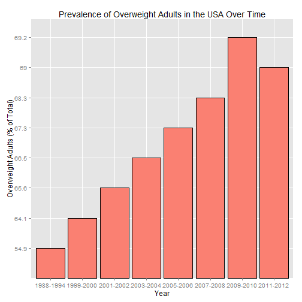

Shiny App to help you track your Body Mass Index
========================================================
height: 800
width: 1200
transition: rotate

author: mbadba
date: November 23, 2014

Why Should You Know Your BMI?
========================================================

- Excessive body fat and obesity have been linked to a variety of health problems, ranging from diabetes, to cancer, to coronary heart disease.
- The obesity problem is growing at an alarming rate in developed countries.
- Awareness of the problem is the first step toward a solution.
- Body Mass Index is a simple and effective way of measuring body fatness for most adults.

Proportion of Overweight Adults Is Increasing
========================================================


```r
p <- ggplot(data = prevalenceOverweight, aes(x=Year, y=PctOverweight)) + geom_bar(stat="identity", colour="black", fill="salmon") + ylab("Overweight Adults (% of Total)") + ggtitle("Prevalence of Overweight Adults in the USA Over Time")
```
***
 
Source: http://www.cdc.gov/nchs/data/hus/hus13.pdf#064

Why use the Body Mass Index Calculator?
========================================================
- Easily available online
- https://mbadba.shinyapps.io/Body-Mass-Index-Calculator/
- No need to use complicated formulas: simply enter your height and weight
- Available using both English and Metric units
- Provides your BMI calculation and helps you interpret your results


Additional Resources
========================================================
- For more information on the Body Mass Index, please visit the US Center for Disease Control and Prevention (CDC)
http://www.cdc.gov/healthyweight/assessing/bmi/adult_bmi/index.html. 
- For more information on healthy eating, please visit the Academy of Nutrition and Dietetics
http://www.eatright.org/. 
